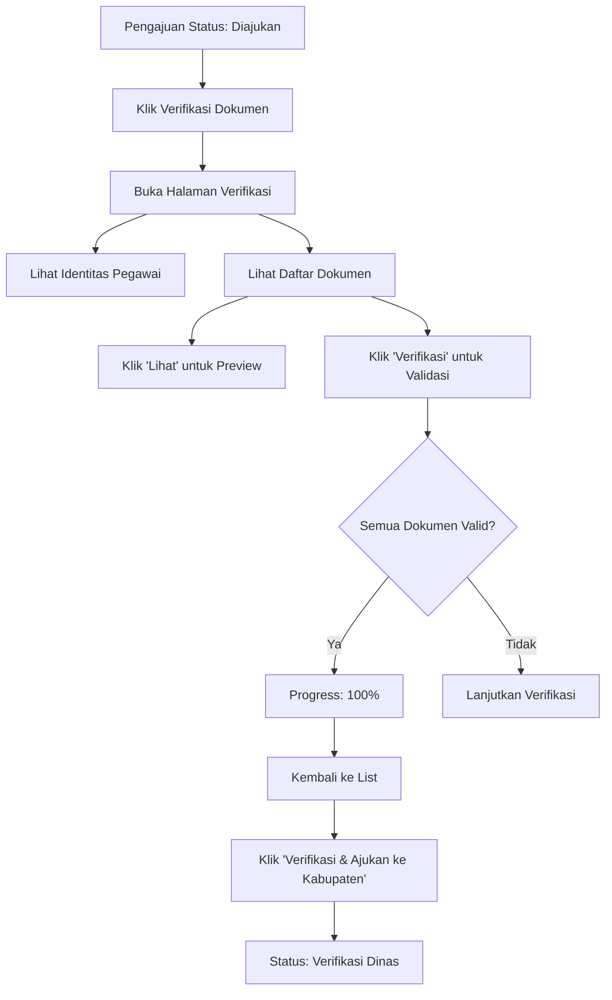

# Panduan Implementasi Verifikasi KGB

## Overview

Implementasi ini menyediakan fitur verifikasi dokumen KGB dengan custom page menggunakan Livewire untuk FlamentPHP 3.3. Fitur ini memungkinkan verifikator untuk melihat dan memverifikasi dokumen persyaratan KGB secara interaktif.

## Fitur Utama

✅ **Custom Livewire Page** - Halaman khusus untuk verifikasi dokumen
✅ **Real-time Verification** - Verifikasi dokumen tanpa reload halaman
✅ **Document Preview** - Modal preview untuk melihat dokumen PDF/gambar
✅ **Toggle Verification** - Mudah menandai dokumen sebagai valid/tidak valid
✅ **Progress Tracking** - Melihat progress verifikasi dokumen
✅ **Status Badges** - Visual indicator untuk status setiap dokumen
✅ **Dark Mode Support** - Tampilan responsif dengan dark mode

## Struktur File

```
app/
├── Filament/
│   └── App/
│       └── Resources/
│           ├── PengajuanKgbResource.php (updated)
│           └── PengajuanKgbResource/
│               └── Pages/
│                   └── VerifikasiPengajuanKgb.php (new)
├── Livewire/
│   └── App/
│       └── VerifikasiKgb/
│           ├── PegawaiInfo.php (new)
│           └── DokumenList.php (new)
└── Models/
    └── DokumenPengajuan.php (updated)

resources/
└── views/
    ├── filament/
    │   └── app/
    │       └── resources/
    │           └── pengajuan-kgb-resource/
    │               └── pages/
    │                   └── verifikasi-pengajuan-kgb.blade.php (new)
    └── livewire/
        └── app/
            └── verifikasi-kgb/
                ├── pegawai-info.blade.php (new)
                └── dokumen-list.blade.php (new)
```

## Cara Menggunakan

### 1. Akses Halaman Verifikasi

1. Login sebagai user dengan role: `admin_dinas`, `verifikator_dinas`, atau `operator_dinas`
2. Buka menu **Pengajuan KGB**
3. Pada tabel, cari pengajuan dengan status **"Diajukan"**
4. Klik tombol **"Verifikasi Dokumen"** (icon clipboard dengan checkmark hijau)

### 2. Melihat Informasi Pegawai

Di bagian atas halaman verifikasi, Anda akan melihat **Section Identitas Pegawai** yang menampilkan:

- NIP
- Nama Pegawai
- Pangkat/Golongan
- Jabatan
- Unit Kerja
- TMT KGB Terakhir
- TMT KGB Baru (yang diajukan)
- Status Pengajuan

### 3. Verifikasi Dokumen

Di bagian **Daftar Dokumen Persyaratan**, untuk setiap dokumen Anda dapat:

#### a. Melihat Dokumen
- Klik tombol **"Lihat"** (icon mata)
- Dokumen akan terbuka dalam modal preview
- Klik **X** atau area di luar modal untuk menutup

#### b. Memverifikasi Dokumen
- Klik tombol **"Verifikasi"** (icon checkmark dalam lingkaran)
- Button akan berubah menjadi hijau dengan teks **"Terverifikasi"**
- Status dokumen berubah menjadi **"Valid"**
- Timestamp verifikasi dan ID verifikator akan tersimpan

#### c. Membatalkan Verifikasi
- Jika dokumen sudah terverifikasi (button hijau), klik lagi untuk membatalkan
- Button akan kembali ke warna abu-abu dengan teks **"Verifikasi"**
- Status dokumen berubah menjadi **"Belum Diperiksa"**

### 4. Progress Tracking

Di bagian bawah daftar dokumen, Anda akan melihat:

- Jumlah dokumen yang sudah terverifikasi vs total dokumen
- Notifikasi "**Semua dokumen sudah terverifikasi**" jika semua dokumen valid

### 5. Status Dokumen

Setiap dokumen memiliki status badge dengan warna:

| Status | Warna | Keterangan |
|--------|-------|------------|
| **Belum Diperiksa** | Abu-abu | Dokumen belum diverifikasi |
| **Valid** | Hijau | Dokumen sudah terverifikasi dan valid |
| **Tidak Valid** | Merah | Dokumen ditandai tidak valid |
| **Revisi** | Kuning | Dokumen perlu direvisi |

## Workflow Verifikasi



## API Livewire Component

### PegawaiInfo Component

**Props:**
- `pengajuanId` - ID dari pengajuan KGB

**Methods:**
- `loadData()` - Load data pegawai dan pengajuan

### DokumenList Component

**Props:**
- `pengajuanId` - ID dari pengajuan KGB

**Methods:**
- `loadDokumens()` - Load semua dokumen pengajuan
- `viewDokumen($dokumenId)` - Buka modal preview dokumen
- `verifikasiDokumen($dokumenId)` - Toggle status verifikasi dokumen
- `setTidakValid($dokumenId, $catatan)` - Tandai dokumen sebagai tidak valid

## Database Schema

Tabel `dokumen_pengajuan` menggunakan field berikut untuk verifikasi:

```sql
status_verifikasi VARCHAR(255) DEFAULT 'belum_diperiksa'
    -- Nilai: belum_diperiksa, valid, tidak_valid, revisi

catatan_verifikasi TEXT NULL
    -- Catatan dari verifikator

verifikator_id BIGINT UNSIGNED NULL
    -- Foreign key ke users table

tanggal_verifikasi TIMESTAMP NULL
    -- Timestamp saat dokumen diverifikasi
```

## Customization

### Menambah Status Dokumen Baru

Edit file `app/Livewire/App/VerifikasiKgb/DokumenList.php`:

```php
public function setStatusCustom($dokumenId, $status, $catatan = null)
{
    $dokumen = DokumenPengajuan::find($dokumenId);
    
    if ($dokumen) {
        $dokumen->update([
            'status_verifikasi' => $status,
            'catatan_verifikasi' => $catatan,
            'verifikator_id' => Auth::id(),
            'tanggal_verifikasi' => now(),
        ]);

        $this->loadDokumens();
    }
}
```

### Menambah Validasi Tambahan

Edit method `verifikasiDokumen` untuk menambah logic validasi:

```php
public function verifikasiDokumen($dokumenId)
{
    $dokumen = DokumenPengajuan::find($dokumenId);
    
    // Tambahkan validasi custom
    if ($dokumen && !Storage::exists($dokumen->path_file)) {
        Notification::make()
            ->title('File tidak ditemukan')
            ->danger()
            ->send();
        return;
    }
    
    // ... rest of the code
}
```

## Troubleshooting

### Error: "Class 'Livewire\Component' not found"

**Solusi:**
```bash
composer require livewire/livewire
```

### Error: "View not found"

**Solusi:** Pastikan semua file blade view sudah dibuat di lokasi yang benar:
- `resources/views/filament/app/resources/pengajuan-kgb-resource/pages/verifikasi-pengajuan-kgb.blade.php`
- `resources/views/livewire/app/verifikasi-kgb/pegawai-info.blade.php`
- `resources/views/livewire/app/verifikasi-kgb/dokumen-list.blade.php`

### Modal Preview Tidak Muncul

**Solusi:** Pastikan Alpine.js sudah ter-load. FilamentPHP 3.3 sudah include Alpine.js secara default.

### File Dokumen Tidak Bisa Dibuka

**Solusi:** 
1. Pastikan storage link sudah dibuat:
   ```bash
   php artisan storage:link
   ```
2. Cek permission folder `storage/app/public`
3. Pastikan path file di database benar

## Security

- ✅ Authorization check dilakukan di method `mount()` pada custom page
- ✅ Hanya role tertentu yang bisa mengakses halaman verifikasi
- ✅ Verifikator ID dan timestamp disimpan untuk audit trail
- ✅ File storage menggunakan Laravel Storage dengan security best practices

## Performance

- ✅ Menggunakan Livewire untuk real-time updates tanpa full page reload
- ✅ Query optimization dengan eager loading (`with('pegawai')`)
- ✅ Minimal database queries per interaction
- ✅ Efficient file serving dengan Storage facade

## Future Enhancements

- [ ] Bulk verification untuk memverifikasi multiple dokumen sekaligus
- [ ] Export report verifikasi dalam format PDF
- [ ] Email notification setelah verifikasi selesai
- [ ] History log untuk tracking perubahan status dokumen
- [ ] Image annotation untuk memberikan catatan visual pada dokumen

## Support

Untuk pertanyaan atau issue, silakan buat issue di repository GitHub atau hubungi tim development.

---

**Last Updated:** 15 November 2025
**FilamentPHP Version:** 3.3
**Laravel Version:** 11.x
**Livewire Version:** 3.x
